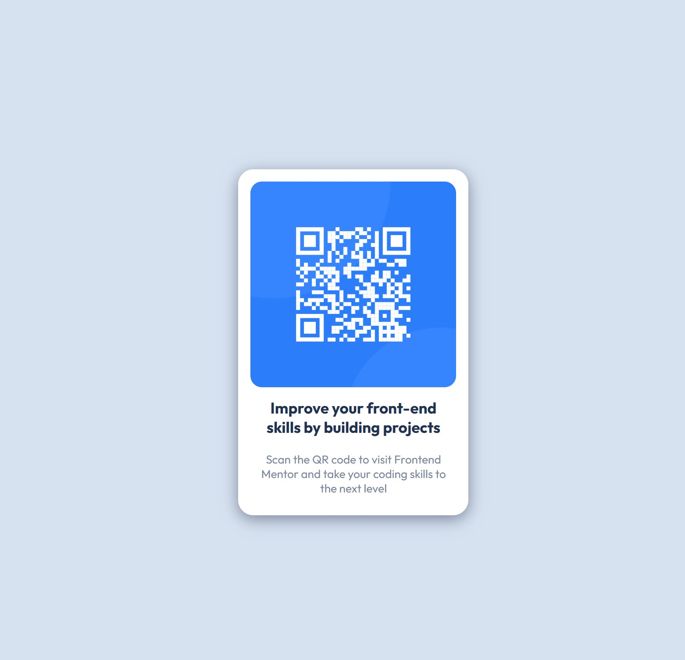

# Frontend Mentor - QR code component solution

This is a solution to the [QR code component challenge on Frontend Mentor](https://www.frontendmentor.io/challenges/qr-code-component-iux_sIO_H). QR code component is a very simple beginner challenge and it helps to reinforce the knowledge of the HTML/CSS foundations.

## Table of contents

- [Overview](#overview)
  - [Screenshot](#screenshot)
  - [Built with](#built-with)
  - [Useful resources](#useful-resources)

## Overview

### Screenshot

### Built with

- Semantic HTML5 markup
- CSS custom properties
- CSS Grid (only for centering the component)

### Useful resources

- [CSS Variables - The var() Function](https://www.w3schools.com/css/css3_variables.asp) - This helped me to remember about CSS variables that were used in the project.

